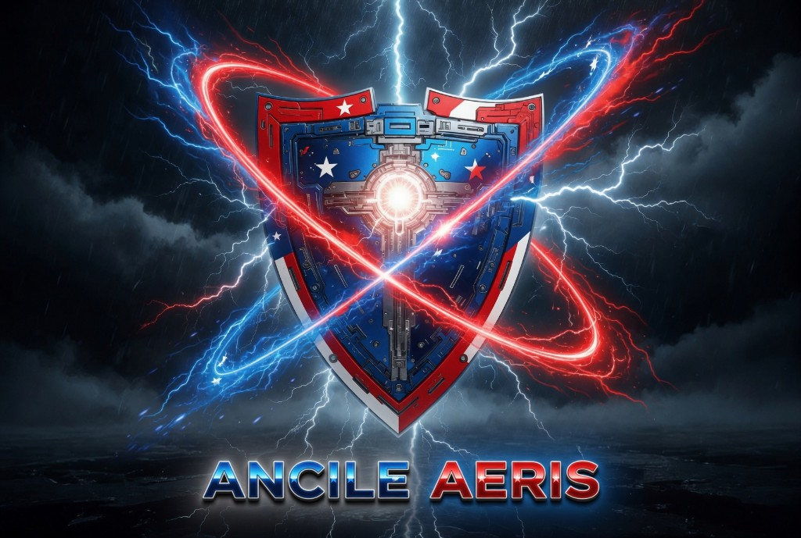
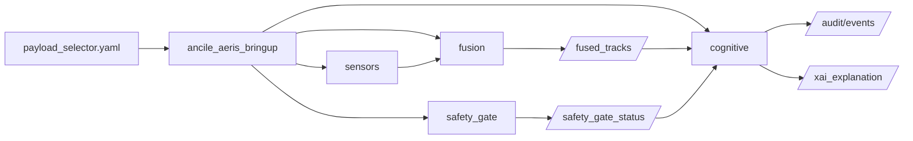
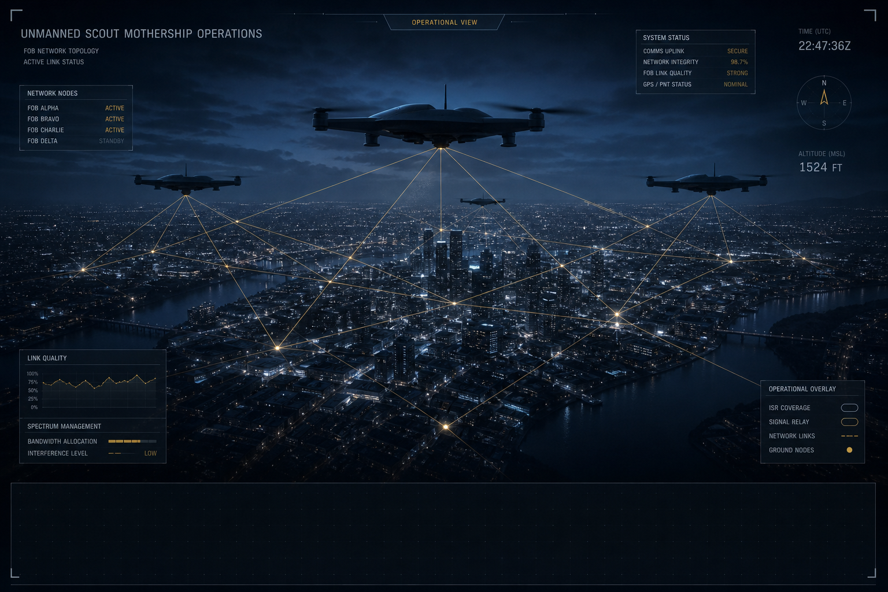

<p align="center">
  
</p>

<h1 align="center">Ancile Aeris</h1>

<p align="center">
  <strong>Simulation-first ROS 2 Counter-UAS research stack</strong><br />
  Auditable detect → track → identify → mitigate modeling with human-on-the-loop safety gates
</p>

<p align="center">
  <a href="https://github.com/Fratres-X-AI/Ancile-Aeris/actions/workflows/ci.yml"></a>
  <a href="LICENSE"></a>
  <a href="https://docs.ros.org/en/kilted/"></a>
  <a href="docker/"></a>
  
</p>

<p align="center">
  <a href="#quick-start">Quick start</a> ·
  <a href="#architecture">Architecture</a> ·
  <a href="#demo">Demo</a> ·
  <a href="docs/ARCHITECTURE.md">Docs</a> ·
  <a href="CONTRIBUTING.md">Contributing</a>
</p>

---

> **Safety posture:** Simulation-only defensive demonstration. **No autonomous weapon release.** Kinetic last-resort paths exist only as simulation stubs and are **policy-off by default**. Government and industry references are alignment examples only and do not imply endorsement.

**Ancile Aeris** is an open research prototype from [Fratres X AI](https://github.com/Fratres-X-AI): a modular ROS 2 workspace that models layered Counter-UAS (C-UAS) defense for dense urban, mass-gathering, and critical-infrastructure contexts—with immutable audit trails, explainability hooks, and strict human authority.

Built as a software-first response to **DHS S&T LRBAA 24-01 / BORAP 04** (Countering Unmanned Aircraft Systems). Formal submission materials live under [`submission/`](submission/).

## Why this repo

| Signal | What you get |
|--------|----------------|
| **Safety-encoded architecture** | PID gates, human veto, IFF, digital-twin rehearsal before effector planning |
| **Audit spine** | DARKSPACE-style immutable hashing for oversight and analytic replay |
| **Operator-first UX** | Copilot query path + XAI-bearing cognitive recommendations |
| **Reproducible runtime** | Docker-only supported path on ROS 2 Kilted; CI builds and tests every push |
| **Honest maturity** | Clear stub vs demo boundaries; non-kinetic-first effector policy |

## Quick start

**Supported method: Docker only.** Do not run `colcon build` natively on Windows—mixed Linux/Windows caches break the workspace.

```bash
# From repository root
ANCILE_LAUNCH_FILE=ancile_aeris_basic_demo.launch.py \
  docker compose -f docker/docker-compose.yml up --build
```

Clean rebuild inside the running container:

```bash
cd /opt/ancile_aeris_ws
source /opt/ros/kilted/setup.bash
./clean-build.sh
# then
ros2 launch ancile_aeris_bringup ancile_aeris_basic_demo.launch.py
```

Smoke-check topics after launch:

```bash
ros2 topic list | grep -E '^/fused_tracks|^/audit/events|^/safety_gate_status|^/mesh/fob_status|^/effector/'
```

Full test workflow: [`docs/TESTING.md`](docs/TESTING.md).

## Architecture



**v2.1 basic demo chain:** sensors → fusion → DARKSPACE audit → safety gate → mothership FOB swarm + modular micro-payload simulation → operator copilot → non-kinetic-first effectors.

Default profile (`mothership_fob_standard`): 2–4 FOB carriers with modular micro slots (sensor, acoustic, web, cognitive EW, optional kinetic sim slot—**off by default**).

## Demo

<p align="center">
  
</p>

**Live stack:** launch the basic demo (Quick start above), then inspect `/fused_tracks`, `/audit/events`, `/safety_gate_status`, and `/effector/*`.

**Reviewer video:** [`artifacts/video_v21/Ancile_Aeris_v2.1_LRBAA_BORAP_04_recorded_voiceover_demo.mp4`](artifacts/video_v21/Ancile_Aeris_v2.1_LRBAA_BORAP_04_recorded_voiceover_demo.mp4)

**Narrative package:** [`submission/LRBAA_Submission_Package_v2.1.md`](submission/LRBAA_Submission_Package_v2.1.md)

If media files are missing after clone, run `git checkout -- artifacts/video_v21` (or `git lfs pull` if LFS is enabled).

## Repository map

```text
├── src/                 # ROS 2 packages (bringup, sensors, fusion, safety, cognitive, effectors…)
├── docker/              # Supported runtime (Dockerfile + compose)
├── config/              # Shared YAML (ROE, security stubs, sensors, payload selector)
├── launch/              # Top-level launch files
├── docs/                # Architecture, testing, BORAP mapping
├── submission/          # LRBAA / BORAP narrative package
├── artifacts/           # Demo video + keyframes
├── k8s/                 # Example edge manifests
├── scripts/             # Scenario helpers
└── tools/               # Doc/video render utilities
```

## Core philosophy

- Max-defensive safety gates (**PID ≥ 0.999** + multi-modal evidence)
- Strict **human-on-the-loop** — never latent kill automation
- DARKSPACE immutable hashing for oversight / replay
- XAI overlays on selectable modeling outcomes
- **Layered posture:** ground sensing → FOB mothership swarm → modular micro payloads (sim) → **non-kinetic first**

## Documentation

| Doc | Purpose |
|-----|---------|
| [`docs/ARCHITECTURE.md`](docs/ARCHITECTURE.md) | Module topology & data flow |
| [`docs/COGNITIVE_ARCHITECTURE.md`](docs/COGNITIVE_ARCHITECTURE.md) | Cognitive adjunct roadmap |
| [`docs/TESTING.md`](docs/TESTING.md) | Build, test, smoke validation |
| [`docs/LRBAA_BORAP_04_MAPPING.md`](docs/LRBAA_BORAP_04_MAPPING.md) | Solicitation mapping |
| [`CONTRIBUTING.md`](CONTRIBUTING.md) | Dev setup & PR expectations |
| [`SECURITY.md`](SECURITY.md) | Vulnerability reporting |
| [`CHANGELOG.md`](CHANGELOG.md) | Release history |

## Cross-platform Docker notes

Windows bind mounts can poison shebangs (`Exec format error`). Compose strips `\r`; launch files prepend `python3` for CRLF resilience on Python entrypoints.

## Contributing

Issues and PRs are welcome—especially tests that import production modules, safety-gate regressions, and documentation clarity. See [CONTRIBUTING.md](CONTRIBUTING.md) and the [Code of Conduct](CODE_OF_CONDUCT.md).

## License

Copyright © 2026 Fratres X AI.

Licensed under the [Apache License, Version 2.0](LICENSE). See [NOTICE](NOTICE) for attribution and the simulation disclaimer.

## Disclaimer

Simulation-only C-UAS defensive demonstration. No autonomous weapon release. Prototype maturity is illustrative (approx. TRL 3–4 integrated simulation). Benchmark figures cited in submission materials are **internal synthetic evaluations**, not operational test results.
