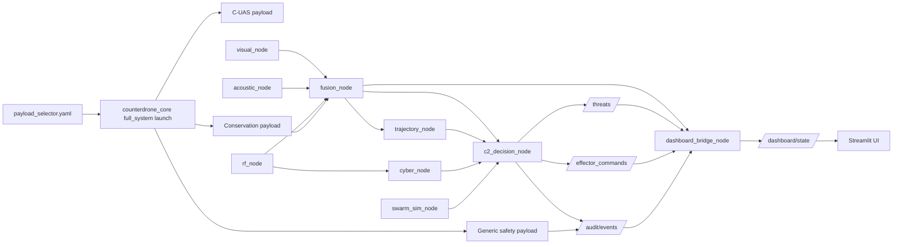

# Ancile-Aeris Architecture

## Node Responsibilities

- `sensor_nodes`: visual/acoustic/rf observations
- `fusion_node`: confidence voting + EKF-style fused tracks
- `trajectory_node`: short-horizon trajectory projection
- `cyber_node`: passive identity/fingerprint assessment
- `swarm_sim_node`: simulation swarm tracks + RL recommendations
- `c2_decision_node`: threat scoring, ROE gating, command and audit generation
- `dashboard_node`: state aggregation and operator display

## Payload Profiles

- `cuas`: full defensive C-UAS launch graph.
- `conservation`: conservation and anti-poaching node set with shared monitor-safe governance.
- `generic`: safety, fusion, audit, and dashboard baseline for cross-domain T&E.

## Deployment Modes

- `sim_mode=true`: simulation-safe test mode for all payloads.
- `sim_mode=false`: non-monitor outputs remain constrained by operator and safety guardrails.
