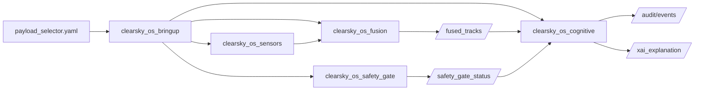

# ClearSky OS Architecture

Module topology for the ClearSky OS ROS 2 workspace ([fratres-x.com](https://fratres-x.com)).

## Node responsibilities

- `clearsky_os_sensors`: visual YOLO (or labeled synthetic); acoustic/RF heuristics (+ optional ONNX); thermal stub
- `clearsky_os_sim`: Gazebo-compatible CUAS world + `/sim/ground_truth` kinematics bridge
- `clearsky_os_fusion`: constant-velocity EKF + Mahalanobis association → `/fused_tracks`
- `clearsky_os_safety_gate`: policy gate state on `/safety_gate_status`
- `digital_twin`: analytic kinematics/risk → `/digital_twin_result` and `/digital_twin/veto`
- `clearsky_os_bringup`: unified launch orchestration
- `clearsky_os_cognitive/*`: cognitive adjuncts (roadmap + demo-enabled subset)
- `clearsky_os_darkspace_integration`: audit / immutable hashing spine
- `clearsky_os_operator_copilot`: operator query interface
- `clearsky_os_effectors`: non-kinetic-first effector planning (simulation)
- `clearsky_os_scout_mothership` + `clearsky_os_micro_payloads`: scout enrichment/mesh + micro-payload sim

## Safety invariants

- Human-on-the-loop authority is required for mitigation modeling
- Kinetic / last-resort simulation paths remain **policy-off by default**
- No autonomous weapon release pathway

See also [`COGNITIVE_ARCHITECTURE.md`](COGNITIVE_ARCHITECTURE.md) and the root [`README.md`](../README.md).
