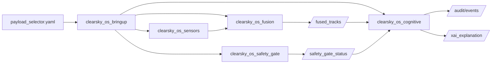

# ClearSky OS Architecture

Module topology for the simulation-first ROS 2 workspace.

## Node responsibilities

- `clearsky_os_sensors`: visual, acoustic, and RF sensor stubs
- `clearsky_os_fusion`: multimodal confidence fusion and `/fused_tracks` publication
- `clearsky_os_safety_gate`: policy gate state on `/safety_gate_status`
- `clearsky_os_bringup`: unified launch orchestration for all capabilities
- `clearsky_os_cognitive/*`: cognitive defensive adjuncts (roadmap + demo-enabled subset)
- `clearsky_os_darkspace_integration`: audit / immutable hashing spine
- `clearsky_os_operator_copilot`: operator query interface
- `clearsky_os_effectors`: non-kinetic-first effector planning (simulation)
- `clearsky_os_scout_mothership` + `clearsky_os_micro_payloads`: FOB swarm + modular micro-payload sim

## Safety invariants

- Human-on-the-loop authority is required for mitigation modeling
- Kinetic / last-resort simulation paths remain **policy-off by default**
- No autonomous weapon release pathway

See also [`COGNITIVE_ARCHITECTURE.md`](COGNITIVE_ARCHITECTURE.md) and the root [`README.md`](../README.md).
