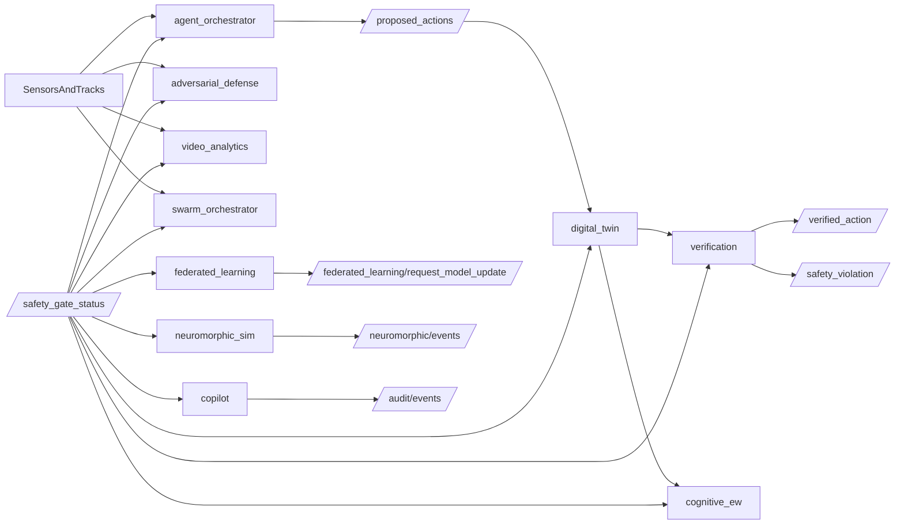

# Cognitive Defensive Shield v2.0 Architecture

## Purpose

This document defines the buildable skeleton for Ancile Aeris Cognitive Defensive Shield v2.0. The current implementation prioritizes modular structure, safety-gated behavior, and rapid demonstration readiness.

## Package Layout

- `src/ancile_aeris_interfaces`: shared messages/services/actions for the cognitive layer.
- `src/ancile_aeris_cognitive`: v2.0 umbrella meta-package.
- `src/ancile_aeris_cognitive/agent_orchestrator`
- `src/ancile_aeris_cognitive/adversarial_defense`
- `src/ancile_aeris_cognitive/digital_twin`
- `src/ancile_aeris_cognitive/cognitive_ew`
- `src/ancile_aeris_cognitive/federated_learning`
- `src/ancile_aeris_cognitive/verification`
- `src/ancile_aeris_cognitive/neuromorphic_sim`
- `src/ancile_aeris_cognitive/video_analytics`
- `src/ancile_aeris_cognitive/swarm_orchestrator`
- `src/ancile_aeris_cognitive/copilot`

## Runtime Dataflow



## Safety Philosophy

- Defensive-only logic with monitor-safe defaults.
- Existing safety gate remains authoritative for actionability.
- Runtime verification provides additional policy checks for PID thresholds and human-veto availability.
- Every package includes TODO markers where real model/control logic will be inserted later.

## Full Skeleton Launch

Use the main full-system launch with feature flags enabled:

```bash
ros2 launch counterdrone_core full_system.launch.py \
  payload:=cuas sim_mode:=true video_enhanced:=true \
  enable_agentic_c2:=true enable_adversarial_defense:=true enable_digital_twin_v2:=true \
  enable_cognitive_ew:=true enable_federated_learning:=true enable_verification:=true \
  enable_neuromorphic_sim:=true enable_video_analytics_v2:=true enable_swarm_orchestrator:=true \
  enable_copilot_v2:=true
```
