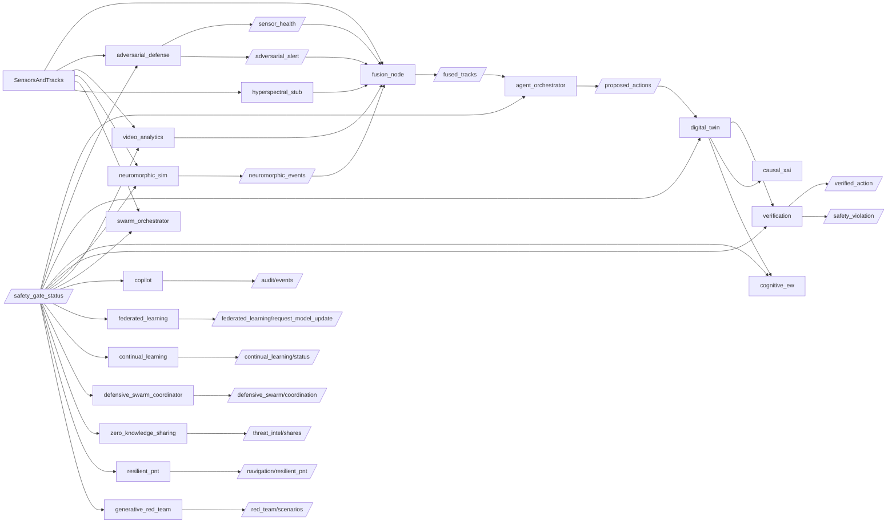

# Ancile Aeris 2.0 Cognitive Autonomous Defensive Shield Architecture

## Purpose

This document defines the buildable skeleton for Ancile Aeris Cognitive Autonomous Defensive Shield v2.0. It is organized to look and operate like a 2026 rapid-prototyping defense program while remaining defensive-only, domestic-deployment aware, human-vetted, explainable, and auditable.

## Layered Capability Model

1. Perception: `video_analytics`, `neuromorphic_sim`, `hyperspectral_stub`, and uncertainty-aware `fusion_node`.
2. Cognition: `adversarial_defense`, `agent_orchestrator`, `cognitive_ew`, and `swarm_orchestrator`.
3. Decision: `digital_twin`, `causal_xai`, and `verification`.
4. Action and resilience: `copilot`, `federated_learning`, and `continual_learning`.
5. Advanced coordination: `defensive_swarm_coordinator`, `zero_knowledge_sharing`, `resilient_pnt`, `generative_red_team`.
6. Foundation rails: `safety_gate_node`, immutable audit/XAI streams, and payload feature controls.

## Package Layout

- `src/ancile_aeris_interfaces`: shared messages/services/actions for the cognitive layer.
- `src/ancile_aeris_cognitive`: v2.0 umbrella meta-package.
- `src/ancile_aeris_cognitive/agent_orchestrator`
- `src/ancile_aeris_cognitive/adversarial_defense`
- `src/ancile_aeris_cognitive/digital_twin`
- `src/ancile_aeris_cognitive/cognitive_ew`
- `src/ancile_aeris_cognitive/federated_learning`
- `src/ancile_aeris_cognitive/verification`
- `src/ancile_aeris_cognitive/neuromorphic_sim`
- `src/ancile_aeris_cognitive/video_analytics`
- `src/ancile_aeris_cognitive/swarm_orchestrator`
- `src/ancile_aeris_cognitive/copilot`
- `src/ancile_aeris_cognitive/hyperspectral_stub`
- `src/ancile_aeris_cognitive/causal_xai`
- `src/ancile_aeris_cognitive/continual_learning`
- `src/ancile_aeris_cognitive/defensive_swarm_coordinator`
- `src/ancile_aeris_cognitive/zero_knowledge_sharing`
- `src/ancile_aeris_cognitive/resilient_pnt`
- `src/ancile_aeris_cognitive/generative_red_team`

## Runtime Dataflow



## Safety Philosophy

- Defensive-only logic with monitor-safe defaults.
- Existing safety gate remains authoritative for actionability.
- Runtime verification provides additional policy checks for PID thresholds and human-veto availability.
- Non-monitor recommendations are proposals requiring human authorization; autonomous domestic actuation is not present.
- Every package includes TODO markers where real model/control logic will be inserted later.

## Defensive Decision Chain

The system models a defensive decision chain rather than an autonomous kill chain:

1. Sense: multimodal tracks, video AI context, and neuromorphic events.
2. Validate: adversarial resilience checks, DARKSPACE-informed operator/tool-trace guards, and sensor health scoring.
3. Fuse: confidence, uncertainty, PID state, and degraded-sensor penalties.
4. Reason: multi-agent C2 proposes monitor-safe or human-review actions.
5. Simulate: the digital twin runs deterministic and generative what-if stubs.
6. Explain: causal XAI generates counterfactual narratives for operator trust and after-action review.
7. Verify: runtime properties block PID, human-veto, and safety-gate violations.
8. Coordinate: defensive swarm, privacy-preserving intel sharing, resilient PNT, and synthetic red-team pressure testing.
9. Audit: every consequential event is explainable and emitted for immutable audit.

## Full Skeleton Launch

Use the main full-system launch with feature flags enabled:

```bash
ros2 launch counterdrone_core full_system.launch.py \
  payload:=cuas sim_mode:=true video_enhanced:=true \
  enable_agentic_c2:=true enable_adversarial_defense:=true enable_digital_twin_v2:=true \
  enable_cognitive_ew:=true enable_federated_learning:=true enable_verification:=true \
  enable_neuromorphic:=true enable_neuromorphic_sim:=true enable_video_analytics_v2:=true enable_swarm_orchestrator:=true \
  enable_copilot_v2:=true enable_hyperspectral_stub:=true enable_causal_xai:=true enable_continual_learning:=true \
  enable_defensive_swarm_coordinator:=true enable_zero_knowledge_sharing:=true enable_resilient_pnt:=true \
  enable_generative_red_team:=true
```
